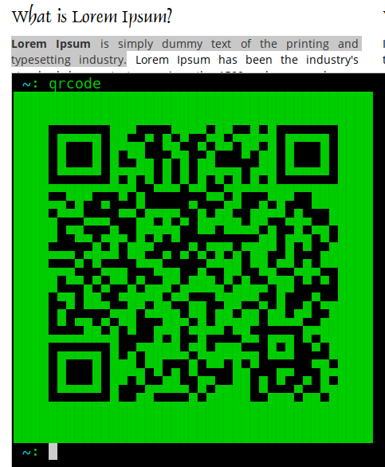
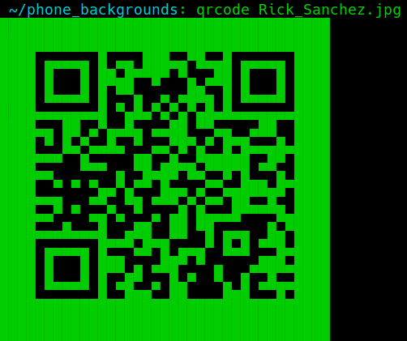

# qrcode
Generate qrcodes from the shell in three ways.

1. Feed `qrcode` some text
   * `qrcode` "I want to turn this string of text into a qrcode.
   * 
2. Highlight some text in your browser, terminal, whatever and run `qrcode`
   * 
3. Feed a file to `qrcode` to generate a qr code that will allow you to download said file through your phone's browser
   * `qrcode` Rick_Sanchez.jpg
   * 
   
Script uses [qrencode](https://fukuchi.org/works/qrencode/) and [netcat](http://netcat.sourceforge.net/) for the heavy lifting.
